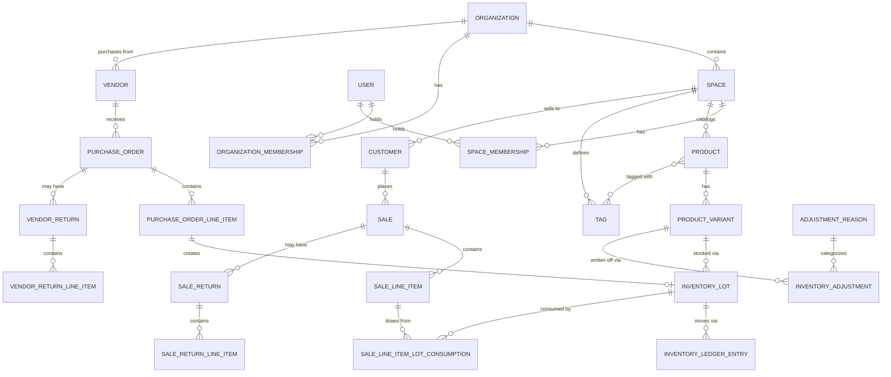

# SmartiePaws Inventory — Database Design

## 1. Overview

A self-hosted (Docker → cloud later) inventory and sales system. Multiple
organizations, each with one or more **Spaces** (teams/workspaces) that have
their own product catalog, purchasing, and sales — while sharing the same
organization and user pool. Single monolith database for now; tables are
named/scoped so Organizations, Spaces, and Users could be split into their
own service later without a redesign.

Goals the schema must support:

- Track products (with variants), who they're purchased from, cost,
  discounts, and shipping.
- Track sales as line items, with discounts and tax.
- Track customers and vendors.
- Support customer returns, vendor returns, and inventory write-offs
  (damaged / donated / internal use / lost).
- Accurate FIFO-based cost of goods sold (COGS) for profit dashboards over
  arbitrary date ranges.
- Know *who* did *what*, always.

## 2. Tech Stack & Conventions

- **Database**: PostgreSQL (Docker container now, managed Postgres in cloud
  later).
- **ORM**: EF Core (code-first migrations).
- **Primary keys**: `uuid` (Postgres `gen_random_uuid()`) on every table —
  not auto-increment `int`/`bigint`. This avoids ID collisions if
  Organizations/Spaces/Users (or anything else) are split into separate
  services/databases later, and avoids leaking row counts.
- **Audit columns**: every table has `CreatedAt`, `UpdatedAt`,
  `CreatedByUserId`, `UpdatedByUserId` (the latter two nullable FK →
  `Users.Id`, null for system-generated rows). This is in addition to the
  append-only inventory ledger (§5.4), which is the authoritative audit
  trail for stock movements specifically.
- **Soft delete / deactivate, don't hard-delete**: any row that can be
  referenced by financial history (Products, ProductVariants, Customers,
  Vendors) gets `IsActive boolean` instead of being deleted, so historical
  sales/purchases keep valid references. Pure lookup/config rows
  (AdjustmentReasons) follow the same pattern.
- **Money**: `numeric(12,2)` for currency amounts, `numeric(12,4)` for unit
  costs/prices (sub-cent precision matters once discounts/shipping are
  allocated across many units).
- **Multi-tenancy enforcement**: EF Core global query filters on
  `SpaceId`/`OrganizationId` for every tenant-owned entity, so a missing
  `.Where()` can't leak data across orgs/spaces. Every query in the app goes
  through the current user's org/space context.

## 3. High-Level Decisions & Rationale

| Decision | Choice | Why |
|---|---|---|
| Tenant isolation | Shared schema, `OrganizationId`/`SpaceId` columns + EF query filters | Simplest to build/run as a monolith; migration path to split services later without re-keying data (UUIDs) |
| Scoping | Org → Space → User membership (roles at both levels) | Teams within one org need separate catalogs/sales, while sharing users/billing at the org level |
| Costing method | FIFO with lot tracking | Accurate COGS/profit when purchase cost changes over time |
| Product structure | Parent Product + Variants (own SKU/stock each) | Supports size/color-type variants without duplicating shared info |
| Location model | Single location per Space (v1) | No current need for multi-warehouse; `Weight` captured now so weight-based shipping allocation can be added without a migration |
| Sales lifecycle | Finalized at entry (POS-style) + separate Return records | Matches Square/Shopify-style retail flow; simpler than a full order-status lifecycle, which is mainly needed for B2B backorder/partial-fulfillment scenarios |
| Purchase order issues | PO status field + separate VendorReturn entity | Handles "never arrived" (stays Cancelled) and "sent back" (VendorReturn) without a full workflow engine |
| Write-offs | Configurable `AdjustmentReasons` lookup table | New reasons (donated, internal use, etc.) addable without code changes |
| Auth | ASP.NET Core Identity + membership tables with roles | Standard, battle-tested; avoids rolling custom password/auth handling |
| Discounts | Line-level **and** sale-level, `(Type: Percent\|Flat, Value)` pair | Covers "10% off this item" and "$5 off the order" with one shape |
| Tax | One rate per sale | No tax-exempt items currently; per-line tax can be added later if needed |
| Shipping on purchases | Allocated into landed unit cost, **by value** (pro-rata on line subtotal) | Industry-standard "landed cost" accounting (GAAP allows capitalizing freight-in); by-value is the simplest allocation and fine when products don't vary wildly in weight-per-dollar — `Weight` field reserved for a future by-weight method |
| Vendors | Organization-wide (shared across Spaces) | A vendor relationship belongs to the business, not one team — multiple Spaces can buy from the same vendor |
| Product categorization | Reusable **Tags**, not free-text or a nested tree | User creates a tag once, then picks from the existing list on future products — simpler than a hierarchy, avoids duplicate near-identical categories from free text |

## 4. Entity-Relationship Overview



## 5. Table Definitions

### 5.1 Identity & Access

**Organizations**
| Column | Type | Notes |
|---|---|---|
| Id | uuid | PK |
| Name | text | |
| CreatedAt / UpdatedAt | timestamptz | |

**Spaces** (team/workspace scope — catalog, sales, purchasing all live here)
| Column | Type | Notes |
|---|---|---|
| Id | uuid | PK |
| OrganizationId | uuid | FK → Organizations |
| Name | text | e.g. "Retail Team", "Online Store" |
| IsActive | boolean | |
| CreatedAt / UpdatedAt | timestamptz | |

**Users** (ASP.NET Core Identity `AspNetUsers`, extended)
| Column | Type | Notes |
|---|---|---|
| Id | uuid | PK (Identity default is string; configure Identity to use uuid) |
| Email, PasswordHash, etc. | — | standard Identity columns |
| FullName | text | |
| CreatedAt | timestamptz | |

**OrganizationMemberships**
| Column | Type | Notes |
|---|---|---|
| Id | uuid | PK |
| OrganizationId | uuid | FK |
| UserId | uuid | FK |
| Role | enum: Owner, Admin, Member | org-level role — Owner manages billing/org settings, creates Spaces |
| CreatedAt | timestamptz | |

**SpaceMemberships**
| Column | Type | Notes |
|---|---|---|
| Id | uuid | PK |
| SpaceId | uuid | FK |
| UserId | uuid | FK |
| Role | enum: Admin, Staff | space-level role — governs catalog/sales/purchasing permissions within that Space |
| CreatedAt | timestamptz | |

### 5.2 Catalog

**Products** (parent)
| Column | Type | Notes |
|---|---|---|
| Id | uuid | PK |
| SpaceId | uuid | FK |
| Name | text | |
| Description | text | nullable |
| Brand | text | nullable |
| IsActive | boolean | |
| CreatedAt / UpdatedAt / CreatedByUserId / UpdatedByUserId | | |

**Tags** (reusable "category" labels — created once, picked from a list thereafter)
| Column | Type | Notes |
|---|---|---|
| Id | uuid | PK |
| SpaceId | uuid | FK — tag list is per-Space, matching catalog scoping |
| Name | text | unique within Space |
| IsActive | boolean | |
| CreatedAt / CreatedByUserId | | |

**ProductTags** (many-to-many)
| Column | Type | Notes |
|---|---|---|
| ProductId | uuid | FK, part of composite PK |
| TagId | uuid | FK, part of composite PK |

**ProductVariants**
| Column | Type | Notes |
|---|---|---|
| Id | uuid | PK |
| ProductId | uuid | FK |
| Sku | text | unique within Space |
| Barcode | text | nullable (UPC/EAN for future scanning) |
| Attributes | jsonb | e.g. `{"size": "Large", "color": "Red"}` — flexible, Postgres-native |
| Weight | numeric(10,3) | nullable; reserved for future by-weight shipping allocation |
| WeightUnit | enum: lb, kg | nullable, pairs with Weight |
| QuantityOnHand | integer | **cached** running total, updated transactionally alongside InventoryLedgerEntries; source of truth is the ledger (§5.4) |
| ReorderPoint | integer | nullable |
| IsActive | boolean | |
| CreatedAt / UpdatedAt / CreatedByUserId / UpdatedByUserId | | |

### 5.3 Vendors & Purchasing

**Vendors** (organization-wide — shared across all Spaces in the org)
| Column | Type | Notes |
|---|---|---|
| Id | uuid | PK |
| OrganizationId | uuid | FK |
| Name, ContactName, Email, Phone, Address, Notes | text | |
| IsActive | boolean | |
| CreatedAt / UpdatedAt | | |

**PurchaseOrders**
| Column | Type | Notes |
|---|---|---|
| Id | uuid | PK |
| SpaceId | uuid | FK |
| VendorId | uuid | FK |
| Status | enum: Draft, Ordered, PartiallyReceived, Received, Cancelled | |
| OrderedAt / ExpectedAt | timestamptz | nullable |
| ShippingCost | numeric(12,2) | total shipping for the PO |
| ShippingAllocationMethod | enum: ByValue (ByWeight reserved) | default ByValue |
| DiscountType | enum: Percent, Flat | nullable, order-level discount |
| DiscountValue | numeric(12,4) | nullable |
| Notes | text | nullable |
| CreatedAt / UpdatedAt / CreatedByUserId / UpdatedByUserId | | |

**PurchaseOrderLineItems**
| Column | Type | Notes |
|---|---|---|
| Id | uuid | PK |
| PurchaseOrderId | uuid | FK |
| ProductVariantId | uuid | FK |
| QuantityOrdered | integer | |
| QuantityReceived | integer | updated as receipts happen (supports PartiallyReceived) |
| UnitCost | numeric(12,4) | cost **before** shipping allocation/discount |
| LineDiscountType | enum: Percent, Flat | nullable |
| LineDiscountValue | numeric(12,4) | nullable |

> On each receipt, a line item's **landed unit cost** = `UnitCost − line discount share + allocated shipping share` (allocated by value across all lines in the PO). That landed cost is what gets written onto the `InventoryLot` created for the received quantity.

**VendorReturns** (sending bad/unwanted stock back to a vendor)
| Column | Type | Notes |
|---|---|---|
| Id | uuid | PK |
| PurchaseOrderId | uuid | FK |
| VendorId | uuid | FK |
| ReasonId | uuid | FK → AdjustmentReasons |
| Status | enum: Draft, Shipped, Credited | |
| CreatedAt / CreatedByUserId | | |

**VendorReturnLineItems**
| Column | Type | Notes |
|---|---|---|
| Id | uuid | PK |
| VendorReturnId | uuid | FK |
| InventoryLotId | uuid | FK — which lot the returned units came from |
| Quantity | integer | |
| CreditAmount | numeric(12,2) | nullable, refund/credit from vendor |

### 5.4 Inventory Costing (FIFO)

**InventoryLots** — one row per "batch" of stock at a specific landed cost.
| Column | Type | Notes |
|---|---|---|
| Id | uuid | PK |
| ProductVariantId | uuid | FK |
| SpaceId | uuid | FK |
| PurchaseOrderLineItemId | uuid | FK, nullable (null for lots created by an adjustment, e.g. "Found" stock) |
| UnitCost | numeric(12,4) | landed cost for this lot |
| QuantityReceived | integer | original quantity |
| QuantityRemaining | integer | decremented by FIFO consumption (sales, write-offs, vendor returns) |
| ReceivedAt | timestamptz | drives FIFO ordering |
| CreatedAt | | |

**InventoryLedgerEntries** — append-only log of every stock movement; the
authoritative audit trail and the source for profit/COGS dashboards.
| Column | Type | Notes |
|---|---|---|
| Id | uuid | PK |
| ProductVariantId | uuid | FK |
| SpaceId | uuid | FK |
| InventoryLotId | uuid | FK — which lot this movement affected |
| QuantityDelta | integer | positive (receipt, return-restock) or negative (sale, write-off, vendor return) |
| UnitCostAtTransaction | numeric(12,4) | snapshot, independent of later lot changes |
| TransactionType | enum: Purchase, Sale, SaleReturn, VendorReturn, Adjustment | |
| ReferenceId | uuid | nullable — points at the Sale/PurchaseOrder/VendorReturn/InventoryAdjustment row |
| OccurredAt | timestamptz | |
| CreatedByUserId | uuid | FK — who/what triggered this movement |

### 5.5 Sales & Customers

**Customers**
| Column | Type | Notes |
|---|---|---|
| Id | uuid | PK |
| SpaceId | uuid | FK |
| Name, Email, Phone, Address, Notes | text | |
| IsActive | boolean | |
| CreatedAt / UpdatedAt | | |

**Sales**
| Column | Type | Notes |
|---|---|---|
| Id | uuid | PK |
| SpaceId | uuid | FK |
| CustomerId | uuid | FK, nullable (walk-in/anonymous) |
| Status | enum: Completed, PartiallyRefunded, Refunded, Voided | |
| SoldAt | timestamptz | |
| Subtotal | numeric(12,2) | |
| DiscountType | enum: Percent, Flat | nullable, sale-level |
| DiscountValue | numeric(12,4) | nullable |
| DiscountAmount | numeric(12,2) | resolved amount |
| ShippingAmount | numeric(12,2) | if shipping charged to customer |
| TaxRate | numeric(6,4) | one rate per sale |
| TaxAmount | numeric(12,2) | |
| Total | numeric(12,2) | |
| PaymentMethod | enum: Cash, Card, Other | nullable |
| CreatedAt / CreatedByUserId | | |

**SaleLineItems**
| Column | Type | Notes |
|---|---|---|
| Id | uuid | PK |
| SaleId | uuid | FK |
| ProductVariantId | uuid | FK |
| Quantity | integer | |
| UnitPrice | numeric(12,4) | sale price |
| LineDiscountType | enum: Percent, Flat | nullable |
| LineDiscountValue | numeric(12,4) | nullable |
| LineDiscountAmount | numeric(12,2) | resolved |
| LineTotal | numeric(12,2) | |
| UnitCostAtSale | numeric(12,4) | **weighted** snapshot of FIFO cost consumed for this line (for margin reporting even if lots change later) |

**SaleLineItemLotConsumptions** — a sale line item's quantity may be drawn
from multiple FIFO lots; this records exactly which.
| Column | Type | Notes |
|---|---|---|
| Id | uuid | PK |
| SaleLineItemId | uuid | FK |
| InventoryLotId | uuid | FK |
| QuantityConsumed | integer | |
| UnitCost | numeric(12,4) | cost from that lot at time of sale |

**SaleReturns**
| Column | Type | Notes |
|---|---|---|
| Id | uuid | PK |
| SaleId | uuid | FK |
| ReasonId | uuid | FK → AdjustmentReasons |
| ReturnedAt | timestamptz | |
| RefundAmount | numeric(12,2) | |
| CreatedAt / CreatedByUserId | | |

**SaleReturnLineItems**
| Column | Type | Notes |
|---|---|---|
| Id | uuid | PK |
| SaleReturnId | uuid | FK |
| SaleLineItemId | uuid | FK |
| QuantityReturned | integer | |
| RefundAmount | numeric(12,2) | |
| Restocked | boolean | whether it went back into inventory |
| InventoryLotId | uuid | FK, nullable — new or existing lot it was restocked into |

### 5.6 Write-offs / Adjustments

**AdjustmentReasons** (configurable; also reused by SaleReturns/VendorReturns)
| Column | Type | Notes |
|---|---|---|
| Id | uuid | PK |
| OrganizationId | uuid | FK |
| Name | text | e.g. "Donated", "Damaged", "Internal Use", "Lost", "Customer Return - Wrong Size" |
| IsActive | boolean | |

**InventoryAdjustments**
| Column | Type | Notes |
|---|---|---|
| Id | uuid | PK |
| SpaceId | uuid | FK |
| ProductVariantId | uuid | FK |
| InventoryLotId | uuid | FK |
| ReasonId | uuid | FK → AdjustmentReasons |
| QuantityDelta | integer | negative for write-offs, positive for found stock |
| Notes | text | nullable |
| CreatedAt / CreatedByUserId | | |

## 6. Key Business Rules

### 6.1 FIFO consumption
When stock leaves (sale, vendor return, write-off), consume from
`InventoryLots` for that `ProductVariantId` ordered by `ReceivedAt` ascending,
oldest first, until the required quantity is satisfied — potentially
spanning multiple lots. Each lot touched produces one
`InventoryLedgerEntry` (and, for sales, one `SaleLineItemLotConsumption`
row) carrying that lot's `UnitCost`.

### 6.2 Landed cost on receipt
```
line_subtotal         = unit_cost * quantity_received
po_subtotal           = sum(line_subtotal for all lines)
line_shipping_share    = shipping_cost * (line_subtotal / po_subtotal)
line_discount_amount   = resolved from line or PO-level discount
landed_unit_cost       = (line_subtotal - line_discount_amount + line_shipping_share) / quantity_received
```
This `landed_unit_cost` is what gets stored on the new `InventoryLot`.

### 6.3 Profit / COGS dashboards
Because every movement is in `InventoryLedgerEntries` with a cost and
timestamp, date-ranged dashboards are plain aggregate queries:
- **Revenue** = `sum(Sales.Total)` where `SoldAt` in range.
- **COGS** = `sum(QuantityDelta * UnitCostAtTransaction)` where
  `TransactionType = Sale` (sign-adjusted) in range.
- **Gross profit** = Revenue − COGS, also sliceable by Space, Product,
  Category, or Customer.

No separate aggregate/summary tables needed for v1; if report queries get
slow at scale, add a materialized view or periodic rollup table later
without changing the source-of-truth tables.

## 7. Deferred / Future Enhancements

(Explicitly scoped out for v1 — noted so the schema doesn't block them.)

- **Multi-location inventory** within a single Space (would add a
  `Locations` table and move `QuantityOnHand`/lots to be location-scoped).
- **Weight-based shipping allocation** (`ShippingAllocationMethod.ByWeight`)
  — `Weight` column already reserved on `ProductVariants`.
- **Per-line-item tax rates / tax-exempt products** — currently one
  `TaxRate` per sale.
- **Split/partial payments** — currently one `PaymentMethod` per sale; a
  `Payments` table could be added without touching `Sales`.
- **Full B2B order lifecycle** (Draft/Pending/Fulfilled/Invoiced with
  backorders) if wholesale customers are added later — would sit alongside,
  not replace, the current POS-style `Sales` flow.
- **Splitting Organizations/Users/Spaces into a separate service** — UUID
  keys and the Org→Space→membership shape are chosen to make this a data
  migration, not a redesign.
- **Additional dashboards** beyond profit/cost/date-range — e.g. low-stock
  alerts, vendor spend reports, top customers — to be added when needed;
  the ledger/lot tables already carry enough data to support these without
  schema changes.
